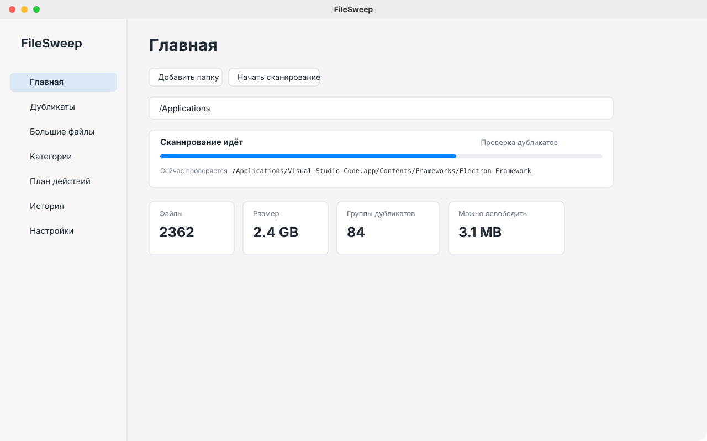
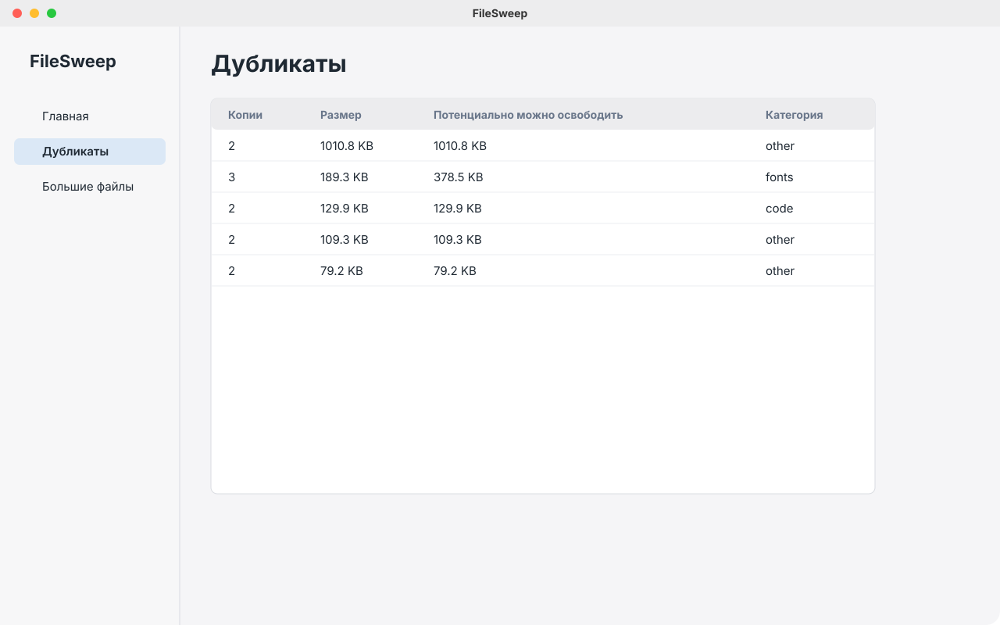
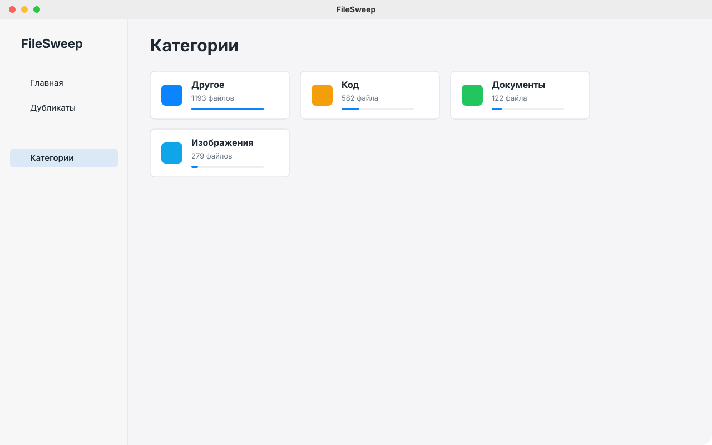

# FileSweep

FileSweep - локальное desktop-приложение для аккуратной уборки папок. Оно сканирует выбранные директории, находит точные дубликаты, показывает крупные файлы, раскладывает содержимое по категориям и помогает собрать план действий перед тем, как что-то переносить или отправлять в корзину.

Главная идея простая: приложение должно быстро показать, что происходит с файлами, но последнее решение всегда остается за пользователем. Никаких автоматических удалений, облака, аккаунтов, телеметрии и фоновой чистки.

## Скриншоты

### Главная



### Дубликаты



### Категории



## Зачем

Обычный файловый менеджер хорошо показывает папки, но плохо отвечает на вопросы, которые появляются при разборе больших директорий:

- какие файлы действительно одинаковые;
- что занимает больше всего места;
- какие типы файлов преобладают;
- что можно безопасно перенести;
- что именно произойдет перед подтверждением действия.

FileSweep закрывает этот сценарий как отдельный инструмент: сначала обзор и проверка, потом план действий, и только после этого операции с файлами.

## Что уже есть

- Нативная desktop-оболочка на Wails v2.
- Frontend на React и TypeScript.
- Интерфейс в стиле macOS Finder.
- Нативный выбор папки.
- Рекурсивное сканирование директорий.
- Прогресс сканирования с текущим файлом и стадией процесса.
- Отмена сканирования.
- Локальная база SQLite.
- Встроенные SQL-миграции.
- Поиск точных дубликатов по размеру и SHA-256.
- Worker pool для хеширования кандидатов в дубликаты.
- Проверка файлов, которые изменились во время хеширования.
- Категории файлов по расширению и MIME type.
- Экран крупных файлов с поиском и фильтром размера.
- Сводка по категориям.
- План действий перед файловыми операциями.
- Безопасное перемещение с проверкой размера и хеша.
- Перенос между разными томами через copy, verify и удаление исходника.
- Undo для операций перемещения.
- Интеграция с системной корзиной без fallback на безвозвратное удаление.
- История действий.
- Экспорт в CSV.
- Локальные настройки.
- Русская и английская локализация интерфейса.
- Светлая, темная и системная темы.
- Go unit/integration tests.
- Frontend lint, typecheck и Vitest.
- GitHub Actions для PR checks и release builds.

## Что планируется

- Детальная страница группы дубликатов: сравнение всех копий, выбор файла, который нужно оставить, и добавление выбранных копий в план действий.
- Preview изображений для дубликатов и крупных image-файлов.
- Более точные названия категорий и локализация системных ошибок.
- Виртуализация строк для больших результатов сканирования.
- Расширенные фильтры крупных файлов: папка, категория, дата изменения и произвольный размер.
- Более надежная интеграция с корзиной Windows через Shell API.
- Готовые release artifacts для macOS, Windows и Linux.
- Playwright smoke test для полного сценария от сканирования до плана действий.

## Стек

- Go
- Wails v2.12.0
- SQLite через `database/sql`
- `modernc.org/sqlite`
- React
- TypeScript
- Vite
- Zustand
- React Router
- Lucide Icons
- Tailwind CSS
- Vitest
- GitHub Actions

## Платформы

Целевые платформы:

- macOS Intel / Apple Silicon
- Windows 10/11
- Linux x64

Сейчас основная разработка и проверка идут на macOS.

## Разработка

Установить Wails:

```sh
go install github.com/wailsapp/wails/v2/cmd/wails@v2.12.0
```

Установить зависимости frontend:

```sh
npm ci --prefix frontend
```

Запустить приложение:

```sh
wails dev
```

Если после установки команда `wails` не находится, нужно добавить Go bin в `PATH`:

```sh
export PATH="$PATH:$(go env GOPATH)/bin"
```

## Проверки

Сначала собрать frontend — его output встраивается в Go binary через `go:embed`:

```sh
npm ci --prefix frontend
npm run lint --prefix frontend
npm run typecheck --prefix frontend
npm run test --prefix frontend
npm run build --prefix frontend
```

Затем проверить backend:

```sh
gofmt -w $(find . -path ./frontend/node_modules -prune -o -name '*.go' -print)
go vet ./internal/... ./tests .
go test ./internal/... ./tests .
```

Build:

```sh
npm run build --prefix frontend
wails build
```

## Структура проекта

```text
internal/
  application/      scan, actions, undo, export, settings
  domain/           scan, duplicates, actions, settings models
  infrastructure/   SQLite, filesystem, platform adapters
  transport/wails/  Wails API exposed to the frontend

frontend/
  src/app/          application shell
  src/pages/        screens
  src/components/   shared UI
  src/i18n/         translation dictionaries
```

## Приватность

FileSweep не загружает списки файлов, хеши, пути или результаты сканирования на внешние серверы. База данных, настройки, логи, thumbnails и экспорты хранятся локально в директориях данных приложения.

Приложение не выполняет безвозвратное удаление. Операции удаления идут через системную корзину и завершаются ошибкой, если корзина недоступна.

## Лицензия

MIT
